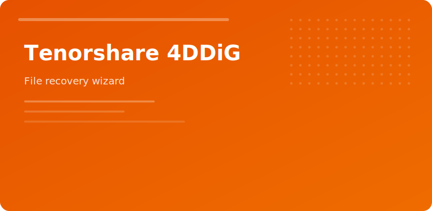

  

  

# Tenorshare 4DDiG

> Recover files when delete, format, or empty recycle bin went wrong.

**Scan types**

1. Quick — recent deletes, healthy filesystem
2. Deep — formatted media, partial corruption
3. Targeted — photos, video, documents only

**Preview first.** Restoring thousands of duplicates fills disks fast.

| Situation | Action |
|-----------|--------|
| Deleted folder | Quick scan same day |
| Formatted SD | Deep scan, save elsewhere |
| USB not mounting | Try different port; avoid chkdsk repair |

Works alongside partition tools—recover data before layout changes when possible.

